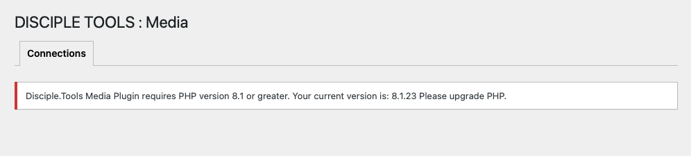
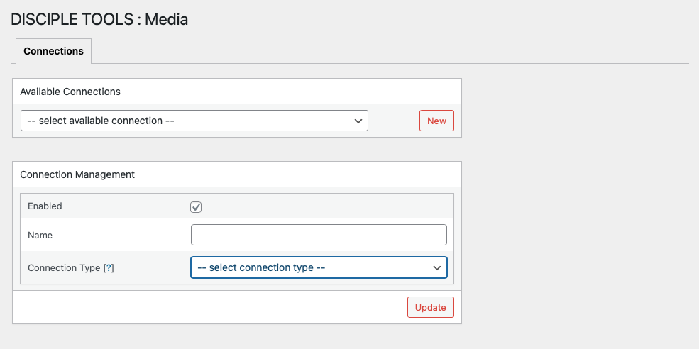
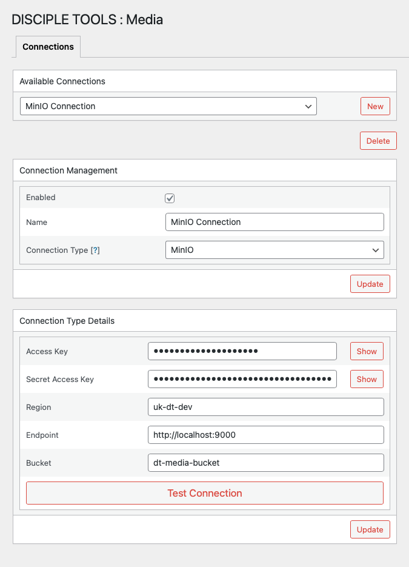
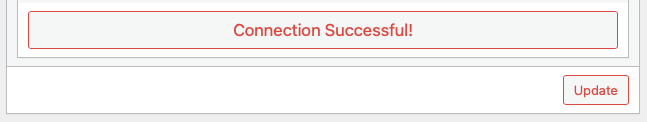
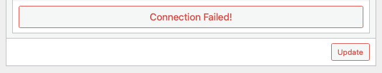
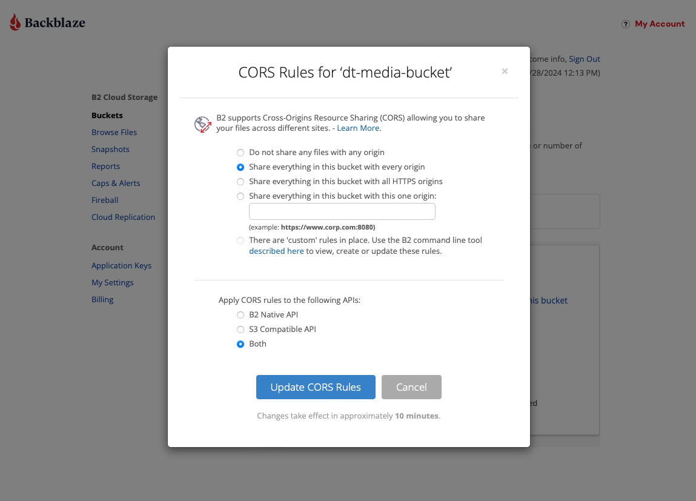
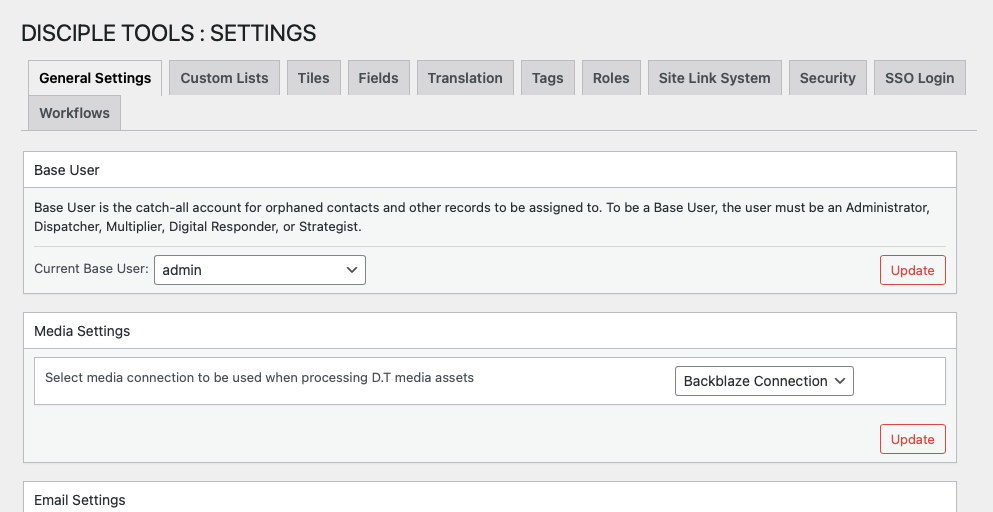
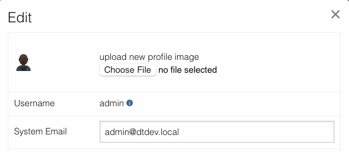

# Disciple.Tools - Storage

Disciple.Tools - Storage is intended to help manage connections with remote object storage services, such as AWS S3, Backblaze, etc.

## Purpose

Provide the ability to store/retrieve all storage content within 3rd party object storage services; offering greater security.

A detailed description of the typical usage flow for creating and using connections is provided below.

## Usage

#### Will Do

- Create multiple object storage services connections.
- Test supplied connection credentials.
- Select default connection to be used for file storage within D.T theme.
- Edit user profile pictures.

#### Will Not Do

- Add media content to comments.
- Add media content to records.

#### Typical Usage Flow

- In order to use the new D.T Storage Plugin, ensure PHP version 8.1 or greater has been installed.

- Once D.T Storage Plugin has been installed, create a new connection.

- The following connection types (3rd Party Object Storage Services) are currently supported:
  - [AWS S3](https://aws.amazon.com/s3/)
  - [BackBlaze](https://www.backblaze.com/)
  - [MinIO](https://min.io/)

- Enter required connection details; ensuring specified bucket has already been created within 3rd party object storage service.

> If no endpoint protocol scheme is specified; then https:// will be used.

- Test connection, to ensure supplied credentials are valid.

- The following will be shown for failed connection tests.

> Some important things to note when working with Backblaze services:
>
> - Ensure sufficient CORS permissions have been applied to target Backblaze bucket, as shown below:

- Once new connection has been validated and saved, navigate to Storage Settings section within D.T General Settings and select connection to be used for the default media storage within D.T.

- Currently, storage connections are only available when editing user profile pictures.

## Requirements

- Disciple.Tools Theme installed on a Wordpress Server.
- Ensure PHP v8.1 or greater, has been installed.

## Installing

- Install as a standard Disciple.Tools/Wordpress plugin in the system Admin/Plugins area.
- Requires the user role of Administrator.

## Contribution

Contributions welcome. You can report issues and bugs in the
[Issues](https://github.com/DiscipleTools/disciple-tools-storage/issues) section of the repo. You can present ideas
in the [Discussions](https://github.com/DiscipleTools/disciple-tools-storage/discussions) section of the repo. And
code contributions are welcome using the [Pull Request](https://github.com/DiscipleTools/disciple-tools-storage/pulls)
system for git. For a more details on contribution see the
[contribution guidelines](https://github.com/DiscipleTools/disciple-tools-storage/blob/master/CONTRIBUTING.md).
